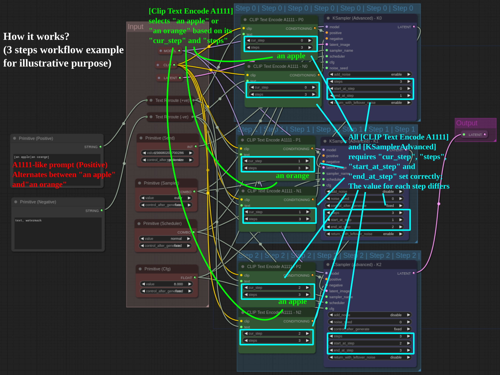
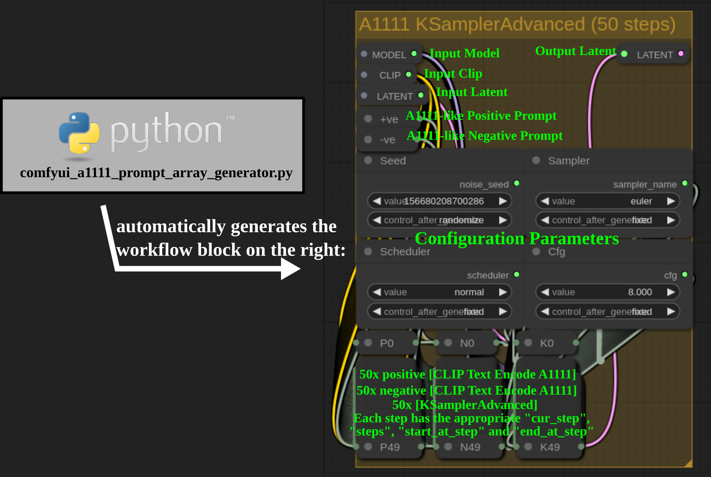
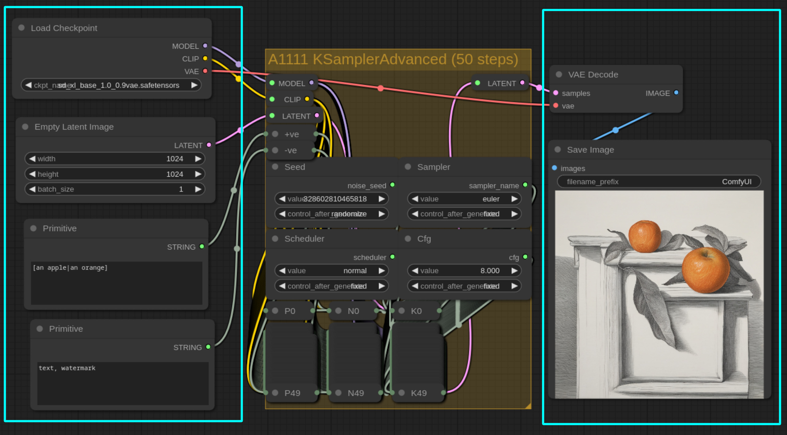

# ComfyUI A1111-like Prompt Custom Node Solution

## How does it work?

* This repository contains:
	* The script `comfyui_a1111_prompt_array_generator.py` for generating the required workflow block because it'd be extremely tedious to create the workflow manually.
	* Two new ComfyUI nodes:
		* `CLIPTextEncodeA1111`: A variant of `CLIPTextEncode` that converts A1111-like prompt into standard prompt
		* `RerouteTextForCLIPTextEncodeA1111`: A kind of `Reroute` for `Text` data type. Workaround for [a ComfyUI bug that prevents Primitive node from being connected with Reroute node](https://github.com/comfyanonymous/ComfyUI/issues/976)

The idea is each step would require a positive `CLIPTextEncodeA1111` node, a negative `CLIPTextEncodeA1111` node and a `KSamplerAdvanced` node. Each node would have information on which particular step it's processing on. Then the `CLIPTextEncodeA1111` node would based on its step information to convert the A1111-like prompt to the actual prompt to be sent to the `KSamplerAdvanced` of that step.

## Syntax

* Alternating Words `[foo|bar]`: step 0 is `foo`, step 1 is `bar`, step 2 is `foo` and so on. Three or more words are also supported.
* Prompt Editing `[foo|bar|0.3]`: Uses `foo` for the first 30% of the steps and `bar` for the remaining steps
	* Warning: This is incompatible with A1111! It uses `|` instead of `:` to avoid conflict with the embedding syntax of ComfyUI.
	* Detection algorithm: If it's three words and the last one is a number, it's Prompt Editing. Otherwise it's Alternating Words
* Recursion is supported. Example: `[[foo|bar]|baz|0.6]` means using `foo` and `bar` every other step for the first 60% of steps, then use `baz` for the remaining steps

## Installation and Usage

### Option A: Quick Start

1. Copy `custom_nodes/clip_text_encoder_a1111.py` to the `custom_nodes` directory of ComfyUI
2. Quick Start: Load [./docs/sample_workflow_50steps.json](./docs/sample_workflow_50steps.json) and that's it!

### Option B: Build your own workflow

1. Copy `custom_nodes/clip_text_encoder_a1111.py` to the `custom_nodes` directory of ComfyUI
2. Run `python3 comfyui_a1111_prompt_array_generator.py 50 > workflow.json`. A workflow block would be generated as shown below:
	* Usage: `python3 comfyui_a1111_prompt_array_generator.py <steps> [step_start inclusive (default:0)] [step_end exclusive (default:max)]`

3. Load the newly generated `workflow.json` to ComfyUI
	* Advanced usage: Use CTRL+Drag to select multiple nodes and then CTRL+C to copy the workflow block. Then you can use CTRL+V to paste the workflow block to another window.
4. Manually build the workflow around it and enjoy! And example is shown below:

## TODO

Implement a script that converts any existing workflow into the one that utilizes `CLIPTextEncodeA1111`, which'd enable controlnet support.
